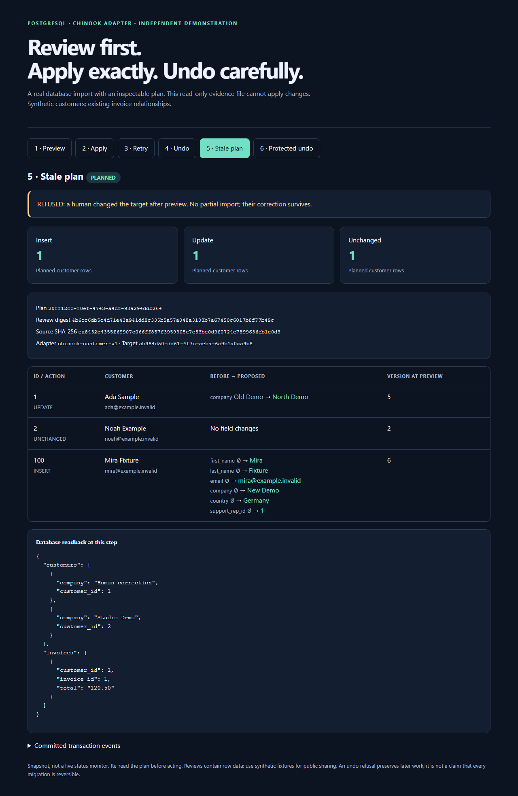

# PostgreSQL Import Rehearsal

[](https://github.com/Hadezu/postgres-import-rehearsal/actions/workflows/verify.yml)

**Review a CSV import before it writes. Apply the exact plan. Refuse an undo that would damage later work.**

Independent engineering example by [Ivan Matiushkin](https://work.matiushkin.com/en), extending the existing [Chinook](https://github.com/lerocha/chinook-database) relational schema. All people and businesses here are synthetic. This is not a client deployment.



**[Download offline review](https://github.com/Hadezu/postgres-import-rehearsal/releases/download/v0.1.0/review.html)** · [Actual database snapshots](evidence/demo.json) · [Verification](docs/verification.md)

## The problem this solves

A migration preview can look correct, then become stale while someone edits the target. A retry can duplicate inserts. A rollback can delete a customer who has since received an invoice.

This bounded customer importer uses real PostgreSQL transactions and foreign keys to make those outcomes inspectable. It complements the portfolio's [data migration service](https://work.matiushkin.com/en/services/data-migration): one export, an explicit mapping, a test import, and acceptance evidence.

| Scenario | Result |
|---|---|
| Preview three source customers | One insert, one update, one unchanged; target untouched |
| Apply the reviewed digest | Target rows + receipt + journal commit together |
| Retry the same plan | Existing outcome returned; no second insert or journal event |
| Process dies after its first write | PostgreSQL rolls the whole transaction back |
| Commit succeeded but response was lost | `show` / retry recovers the committed outcome |
| Target changed after review, even changed back | Entire apply refused; re-preview required |
| Undo after a later customer edit | Entire undo refused; later work preserved |
| Undo after a new invoice references the imported customer | Entire undo refused; invoice history preserved |

## Run without installing Python or PostgreSQL

Prerequisite: Docker Engine with Compose. The isolated database has **no published host port**. The fixed password is only a disposable local demo credential.

```sh
git clone https://github.com/Hadezu/postgres-import-rehearsal.git
cd postgres-import-rehearsal
docker compose build tool
docker compose run --rm tool python scripts/setup_demo.py
docker compose run --rm tool python scripts/demo.py
```

Open `evidence/review.html` locally. It contains six real database snapshots, ending in an intentionally refused undo. `setup_demo.py` refuses a nonempty database; it never resets existing data. `demo.py` is a scripted walkthrough for a freshly initialized fixture database, not an idempotent migration command. The `apply` and `undo` commands themselves are idempotent per plan.

Stop with `docker compose down` (data retained). To deliberately discard **only this Compose project's disposable database**, use `docker compose down -v`.

## Review and apply your own synthetic fixture

Use a fresh demo database instead of running this sequence after the walkthrough:

```sh
docker compose run --rm tool import-rehearsal plan fixtures/customers.csv --mapping fixtures/mapping.json
docker compose run --rm tool import-rehearsal report PLAN_ID --output evidence/plan.html
# Read plan.html: IDs, all changed fields, before/after values, source hash, target and digest.
docker compose run --rm tool import-rehearsal apply PLAN_ID --expect FULL_REVIEW_DIGEST
docker compose run --rm tool import-rehearsal show PLAN_ID
docker compose run --rm tool import-rehearsal undo PLAN_ID --expect FULL_REVIEW_DIGEST
```

Replace `PLAN_ID` and `FULL_REVIEW_DIGEST` with the exact values returned by `plan`. Apply never re-reads a potentially changed CSV: it executes the immutable saved plan. A changed file or mapping needs a new preview. Undo needs the same reviewed identity and rechecks current target state.

Seven mapped fields are supported: customer ID, first/last name, email, company, country and support representative ID. IDs are explicit positive PostgreSQL integers; no fuzzy identity matching or email-based merging. Empty company/country/support-rep fields mean NULL; all other customer fields are preserved on update. Source duplicate IDs, extra/missing columns, invalid values or missing support representatives reject the **whole plan**. Duplicate emails across distinct IDs are permitted by Chinook and do not imply the same person. Input: UTF-8 CSV, at most 1 MiB / 1,000 customers. See [contract and architecture](docs/architecture.md).

## Development and tests

Python 3.12–3.14, uv 0.12.23, PostgreSQL 18.6. `uv.lock` locks dependencies. Point standard libpq `PGHOST`, `PGPORT`, `PGUSER`, `PGPASSWORD`, `PGDATABASE` variables at your **own disposable test server**. The test account needs `CREATEDB`; production credentials should never be used here.

```sh
uv sync --frozen
uv run pytest -q --junitxml=test-results/junit.xml
uv run ruff check .
uv run ruff format --check .
uv run python scripts/setup_demo.py
uv run python scripts/demo.py
uv run playwright install chromium
uv run python scripts/browser_check.py
```

Tests create uniquely named databases and remove only those databases. They use no SQLite substitute, mock transaction engine, paid service, or client credentials. CI additionally runs Docker Compose from scratch, two Python versions, report browser checks and packaging. Local Windows and Linux CI evidence are reported separately in [verification](docs/verification.md).

## Boundaries that matter

- One known schema and one customer slice, not a universal ERP connector, multi-table mapping designer, or zero-downtime migration product.
- Short table locks intentionally serialize customer/invoice writers during apply/undo. This is appropriate for a small agreed test import, not a high-volume always-on importer. Lock and statement timeouts fail without partial writes.
- An unchanged plan replay means that transaction already committed; it does **not** say nobody has changed the database since. Re-read current data for present state.
- Guarded undo is not backup/disaster recovery. It refuses conflicts rather than attempting an automatic merge. External side effects are outside this database transaction.
- A trusted local operator runs the CLI. There is no web authentication, approval authority, tenant isolation or security certification. A digest binds content, not a person's identity. A database owner can bypass triggers; no defense against a malicious DBA is claimed.
- Reports contain row data. Only synthetic evidence belongs in public GitHub. This case does not prove client history, vendor certification, commercial years, production-scale reliability, or the whole stack of any referenced job.

## Ownership and delivery

Chinook's existing schema is Luis Rocha's work; the original permission notice, pinned source and extraction boundaries are in [vendor/chinook](vendor/chinook). No upstream customer data is included. My contribution is the importer, revision tracking, immutable plans, guarded undo, failure/concurrency tests, report, demo and CI. Implemented with Codex assistance and checked through executable tests and database/browser readback; AI use is not itself a quality guarantee.

[Buyer evidence and gap analysis](docs/market-fit.md) · [Architecture and failure recovery](docs/architecture.md) · [Prepared EN/PL portfolio and email copy](docs/commercial-copy.md)

<details>
<summary>Technical verification recording</summary>

Original test recording retained as supporting evidence. For the scenario, results and limitations, see the verification documentation above.

[Download the original recording](https://github.com/Hadezu/postgres-import-rehearsal/releases/download/v0.1.0/demo.webm)

</details>
