# Design and operational contract

```mermaid
flowchart LR
  CSV[CSV + explicit mapping] --> Validate[Validate all rows]
  Validate --> Preview[Repeatable-read target snapshot]
  Preview --> Plan[Immutable database plan + digest]
  Plan --> Review[Offline human review]
  Review --> Apply[Lock + recheck + transactional apply]
  Apply --> Ledger[Rows + receipt + APPLY event]
  Ledger --> Undo[Recheck current versions and references]
  Undo --> Restore[Restore + UNDO event OR refuse everything]
```

## Existing system, bounded adapter

The schema-only extract keeps all eleven Chinook tables, original primary keys, foreign keys and supporting indexes. The importer writes only seven customer fields. Existing address/phone/fax/etc values survive updates; invoice rows are never rewritten. There is no claim of having built Chinook or integrated a commercial CRM vendor.

The new `rehearsal` schema holds an instance UUID, revision tombstones, plans, receipts and transaction events. A trigger on customer INSERT/UPDATE/DELETE takes a sequence revision. Revisions are not timestamps and survive deletion as tombstones. A write followed by reversal therefore still invalidates an old review. Sequence gaps after rollback are normal, not lost customer records. Primary-key rewrites are rejected by this adapter's trigger. TRUNCATE, disabled triggers, schema migration and owner-level tampering are outside the supported normal-writer contract.

## Plan

CSV parsing and limits happen before a connection is opened. Required target fields map to distinct exact source headers. Invalid input rejects all rows; there is no silent quarantine-and-partially-apply behavior. Customer IDs are explicit target IDs, so source-to-target identity decisions must be made before this tool. Email syntax checking is deliberately basic, not a delivery check.

`REPEATABLE READ` gives one consistent snapshot across customer/revision lookups. The payload contains adapter version, target instance UUID, SHA-256 of exact CSV bytes, mapping, before rows/revisions, desired fields and INSERT/UPDATE/UNCHANGED classification. Canonical JSON SHA-256 binds all of that. The database plan is retained and cannot be updated/deleted through normal DML triggers. It contains PII if used with real data: storage/export access and retention require a separate deployment decision.

Preview writes metadata, **not** customer/invoice rows. There is no lock held while a human reviews the report. The static HTML is an escaped read-only snapshot with no remote resources; it cannot approve anything.

## Apply and concurrency

The plan row is locked first. A second application of the same plan waits then returns its committed outcome. An undone plan cannot be reapplied; create a fresh preview.

Customer and invoice tables are locked in fixed order using `SHARE ROW EXCLUSIVE`. This conflicts with ordinary business writers, even when they know nothing about the importer. After locking, the engine re-reads all relevant customer snapshots and revisions before any write. An absent ID that appeared then disappeared is stale too. Unrelated customer edits do not invalidate the plan once their transaction has completed, although table locks temporarily serialize all writers.

Business writes, applied row snapshots, plan status and the unique APPLY event share one transaction. Real PostgreSQL foreign keys check support representatives and invoice relationships. If a referenced support representative disappears after preview, the transaction fails atomically. No SQL identifiers come from CSV/mapping; dynamic column lists are fixed code constants, values are bound parameters.

No network calls, file exports or human review occur inside the write transaction. Connection timeout is 5 seconds, lock timeout 2 seconds, statement timeout 10 seconds, input maximum 1,000 rows / 1 MiB. Per-statement timeout is **not** a hard total transaction deadline. Large datasets need a separately designed staged/batched migration; this implementation intentionally avoids that complexity.

## Undo

Only changed rows are candidates. Every applied row must still have exactly its applied full snapshot and revision. A new imported customer must also have no invoice. Any conflict refuses the entire undo before any target write. Updated fields are restored from before-images; unchanged source rows and unmapped target fields are not rewritten. The database foreign keys remain a final backstop, including support representatives needed by before-images.

Target restoration, UNDONE status and one UNDO event commit together. A repeated undo returns the stored outcome. This is a guarded compensating transaction, not a rollback of arbitrary later history or external side effects.

## Recovery operator guide

| Outcome | Next action |
|---|---|
| `STALE_TARGET` | Keep human changes; create and review a fresh plan |
| `REVIEW_DIGEST_MISMATCH` | Check exact plan and full hash; never bypass |
| `UNDO_CONFLICT` / `UNDO_REFERENCED` | Leave database unchanged; investigate and agree a separate correction |
| Lock timeout (`55P03`) | Check concurrent activity; retry the same reviewed plan when appropriate |
| Foreign-key failure (`23503`) | Reassess reference data and preview again |
| Process/socket dies before commit | PostgreSQL rolls back; inspect then retry |
| Response lost near commit | `show PLAN_ID` on the same target; APPLIED/UNDONE is authoritative; retry is idempotent |
| HTML export fails after planning | `show`/`report` the saved plan; an export failure does not apply target writes |

Events record committed operations, not every rejected attempt; CLI stderr records refusals for the caller. Exported snapshots and videos are not a live monitor. A successful replay means historical completion, not current row equality.

## Tradeoffs and unclaimed guarantees

Trusted local CLI rather than another internet-facing CRUD app; no multi-user approval/auth product. A content hash is not a signature or approval identity. Database owners can alter roles, tables or triggers; ledger triggers are accidental-mutation safeguards, not tamper-proof security. Database backups, secrets management, least-privilege deployment roles, retention, full-volume performance and existing application compatibility require assessment before real use.

References: [PostgreSQL explicit locking](https://www.postgresql.org/docs/current/explicit-locking.html), [transaction isolation](https://www.postgresql.org/docs/current/transaction-iso.html), [foreign keys](https://www.postgresql.org/docs/current/ddl-constraints.html#DDL-CONSTRAINTS-FK). The Postgres Best Practices skill informed short transactions, lock ordering and retaining FK indexes.
